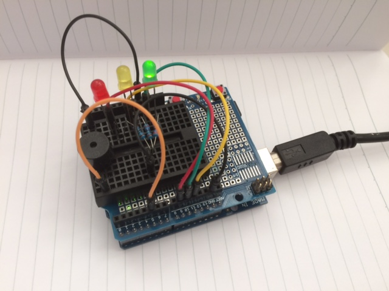

[](https://waffle.io/dapicester/gitlab-ci-monitor?utm_source=badge)
[](https://travis-ci.com/dapicester/gitlab-ci-monitor)
[](https://codecov.io/gh/dapicester/gitlab-ci-monitor)

# GitLab CI Monitor

Monitor the latest build status with colored LEDs using an Arduino board
running Firmata.

## How it works

The scripts periodically poll the GitLab API and retrieve the last build
status, then:

- the green led is turned on if the build is successful
- the yellow led is turned on if the build is in progress or pending
- the red led is turned on when the build is failed
- on the first failure a long buzz is emitted
- when the buid is successful again two short buzzes are emitted
- on network errors three buzzes are emitted and both red and yellow lights
  are turned on



## How to run

Ensure that Bundler is installed:

    $ gem install bundler

Install the required gems:

    $ bundle install

Get an API private token from GitLab by visiting
[your profile page](https://gitlab.com/profile/personal_access_tokens).

Create a `.env` file with the following content:

```shell
export GITLAB_API_PRIVATE_TOKEN="your token here"
export GITLAB_PROJECT_ID="your project id here"
```

Ensure that your Arduino is connected and that LEDs and buzzer
are connected to the right pins (check the `LedMonitor` class).

Finally, just launch the script:

    $ ./monitor.rb

If you want to enable debug output, lauch with:

    $ DEBUG=1 ./monitor.rb

The monitor checks the build status on the `develop` branch.
You can specify a time interval in seconds, the default is `120` (two minutes).
For example, to poll the build status every five minutes:

    $ ./monitor.rb 300

## Multi-project setup

One can easily monitor many projects at once using the `multi-monitor.rb` script.
Create a `projects.yml` file with a content like this:

```yaml
---
- name: company/project1
  branch: develop
  pins:
    red: 11
    green: 12
    yellow: 10
    buzz: 7
- name: company/project2
  branch: master
  pins:
    red: 3
    green: 4
    yellow: 5
    buzz: 7
```

Then launch the script:

    $ ./multi-monitor.rb

The script accepts the same options and arguments as `monitor.rb`.

## Notes

I quickly wrote the script and it basically suits my need.
Please feel free to open an issue or submit a pull request
if you need more features.
